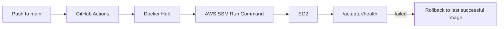

<div align="center">

# Loovi Backend

### Vision AI 기반 디지털 옥외광고 성과 측정 플랫폼 백엔드 Repository

[Frontend](https://github.com/Shinhan-KLLJS/frontend) · [AI / Vision](https://github.com/Shinhan-KLLJS/ai) · [Organization](https://github.com/Shinhan-KLLJS)

</div>

---

## Overview

Loovi Backend는 광고대행사가 디지털 옥외광고의 성과를 데이터로 이해하고 설명할 수 있도록 돕습니다. 현장의 Vision AI 디바이스가 전달한 데이터를 수집하고, 캠페인·매체·팀 정보를 결합해 대시보드와 리포트 API로 제공합니다.

| 영역 | 제공 기능 |
| --- | --- |
| **인증 · 팀** | 카카오 OAuth2 로그인, JWT 인증, 팀 생성과 초대 코드 기반 팀원 관리 |
| **캠페인 · 매체** | 광고 소재 업로드, 매체 검색·선택, 기간 설정, 캠페인 관리 |
| **성과 분석** | 유동·노출·주목 퍼널, 시청 시간, 성별·연령 반응, 시간대별 히트맵 |
| **운영 데이터** | Vision AI 결과 수신, 서울시 생활인구 데이터 적재, 성과 리포트용 데이터 제공 |

## Architecture


### Vision data ingestion

Loovi는 Vision AI 디바이스가 데이터를 **수집**하고, Amazon SQS에 메시지를 **Push**하면 서버가 큐를 **Polling / Pulling**하는 방식으로 설계했습니다.

| Step | Flow | Description |
| --- | --- | --- |
| 1 | **Collect** | Vision AI 디바이스가 전광판 주변의 유동·노출·주목 데이터를 현장에서 분석합니다. |
| 2 | **Push** | 분석 결과를 `Vision Summary` 메시지로 Amazon SQS에 전달합니다. |
| 3 | **Pull** | 백엔드가 SQS를 주기적으로 폴링해 메시지를 가져오고, 검증·집계 후 MySQL에 저장합니다. |
| 4 | **Serve** | 저장된 데이터를 대시보드와 리포트 API로 제공합니다. |


<details>
<summary><strong>배포 흐름</strong></summary>

<br />



</details>

## Tech stack

### Backend

<p>
  
  
  
  
  
  
  
</p>

### Data & API

<p>
  
  
  
  
</p>

### AWS Infrastructure

<p>
  
  
  
  
  
  
  
  
</p>

### Delivery

<p>
  
  
  
</p>

## Quick start

### Prerequisites

- JDK 21

### Run locally

```bash
git clone https://github.com/Shinhan-KLLJS/backend.git
cd backend
./gradlew bootRun
```

Windows CMD에서는 다음 명령을 사용합니다.

```bat
gradlew.bat bootRun
```

별도 DB나 Docker 없이 `local` 프로필로 실행됩니다. 서버가 시작되면 H2 인메모리 DB와 테스트용 시드 데이터가 생성되고, API 테스트용 Access Token이 애플리케이션 로그에 출력됩니다.

| Resource | URL / Setting |
| --- | --- |
| Swagger UI | `http://localhost:8080/swagger-ui/index.html` |
| H2 Console | `http://localhost:8080/h2-console` |
| H2 JDBC URL | `jdbc:h2:mem:klljsdb;MODE=MySQL` |
| H2 user / password | `sa` / 없음 |

Swagger에서 로그에 출력된 토큰을 `Authorization: Bearer {token}` 헤더에 넣으면 API를 바로 호출할 수 있습니다.

## API and environment

### API docs

- **Local**: `http://localhost:8080/swagger-ui/index.html`
- **Production**: deployed server의 `/swagger-ui/index.html`

### Production environment variables

| Category | Variables |
| --- | --- |
| Database | `SPRING_DATASOURCE_URL`, `SPRING_DATASOURCE_USERNAME`, `SPRING_DATASOURCE_PASSWORD` |
| Authentication | `KAKAO_REST_API_KEY`, `KAKAO_CLIENT_SECRET`, `KAKAO_REDIRECT_URI`, `JWT_SECRET` |
| Frontend / CORS | `APP_FRONTEND_URL`, `ADDITIONAL_ALLOWED_ORIGINS`, `APP_SWAGGER_ORIGIN` |
| Vision data | `VISION_SQS_QUEUE_URL` |
| File / OCR | `CAMPAIGN_CREATIVE_BUCKET`, `CAMPAIGN_CREATIVE_PUBLIC_BASE_URL`, `CAMPAIGN_CREATIVE_UPLOAD_TOKEN_SECRET`, `BUSINESS_REGISTRATION_BUCKET`, `BUSINESS_REGISTRATION_UPLOAD_TOKEN_SECRET`, `BUSINESS_REGISTRATION_OCR_FUNCTION` |

운영 시크릿은 코드나 저장소에 넣지 않고 AWS SSM Parameter Store의 `SecureString`으로 관리합니다.

## Test and database migration

```bash
./gradlew test
```

<details>
<summary><strong>MySQL 동시성 테스트와 Flyway 운영 원칙</strong></summary>

<br />

- MySQL 동시성 테스트는 H2와 MySQL의 격리 수준 차이 때문에 별도 태그로 분리되어 있습니다.

  ```bash
  ./gradlew mysqlConcurrencyTest
  ```

- 운영 스키마는 `src/main/resources/db/migration`의 Flyway 마이그레이션으로 관리합니다.
- 이미 운영에 적용된 마이그레이션 파일은 수정하지 않습니다. 불가피하게 수정해야 한다면 배포 전에 운영 환경의 checksum 처리 절차를 검토합니다.
- 로컬 프로필은 H2와 `ddl-auto=create-drop`을 사용하므로, 마이그레이션 검증은 실제 MySQL 환경에서 수행합니다.

</details>

## CI / CD

| Workflow | Trigger | What it does |
| --- | --- | --- |
| [CI](.github/workflows/ci.yml) | `main` / `dev` push, Pull Request | `./gradlew test` 실행 |
| [CD](.github/workflows/cd.yml) | `main` push | Docker 이미지 빌드·푸시, SSM 기반 EC2 배포, 헬스체크 및 실패 시 롤백 |

## Documents

| Document | Description |
| --- | --- |
| [ERD](docs/mvp-database-erd.md) | 전체 ERD와 테이블별 설계 결정 |
| [팀 생성 API](docs/team-creation-api-spec.md) | 사업자등록증 업로드·OCR을 포함한 팀 생성 흐름 |
| [캠페인 등록 API](docs/campaign-registration-api-spec.md) | 소재 업로드부터 캠페인 최종 등록까지의 API 설계 |
| [캠페인 페이지 API](docs/campaign-page-api-spec.md) | 캠페인 목록, 상세, 수정, 삭제 API 설계 |
| [사업자등록증 검증](docs/server-verification-spec.md) | 진위확인 명세와 보류 범위 |

---

<div align="center">

Built by <a href="https://github.com/Shinhan-KLLJS">KLLJS</a>

</div>
