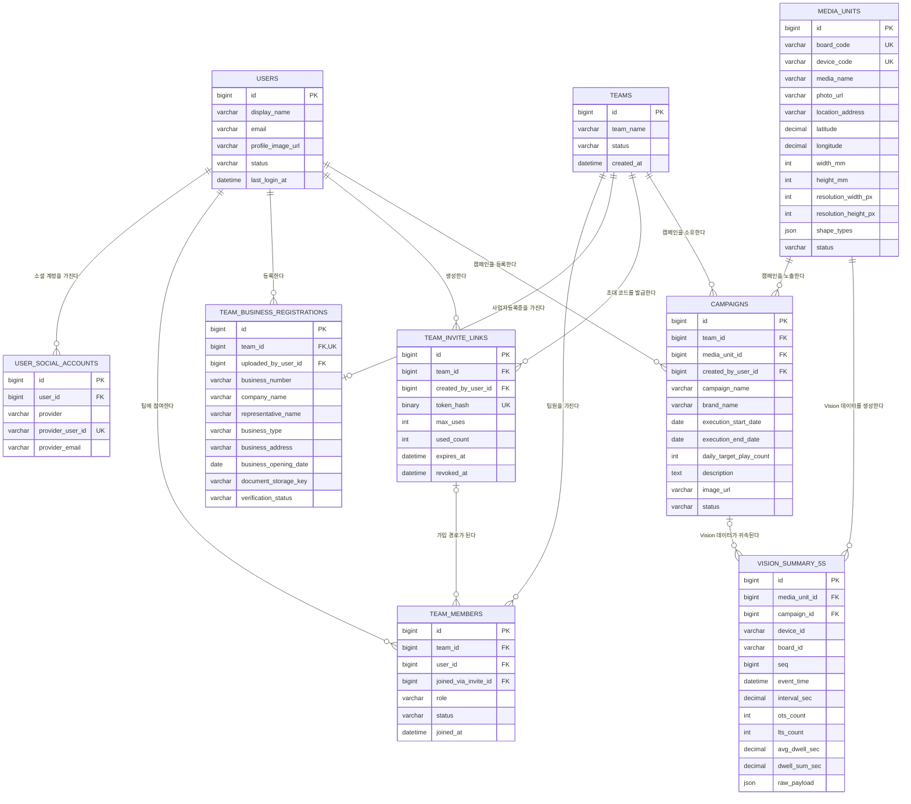

# 옥외광고 Vision 대시보드 MVP 데이터베이스 ERD

## 1. 설계 범위

이 문서는 다음 MVP 요구사항을 기준으로 한 MySQL 8.0 데이터 모델을 설명한다.

- 사용자는 카카오 소셜 로그인으로 가입한다.
- 팀장은 팀과 사업자등록증을 등록한다.
- 팀장(또는 어드민)은 초대 코드를 생성하고 팀원을 초대한다.
- 팀원은 자신이 속한 팀의 캠페인과 대시보드를 조회한다.
- 캠페인 하나는 하나의 매체에만 배정한다.
- 하나의 매체는 기간이 겹치지 않는 여러 캠페인에서 재사용할 수 있다.
- Vision 장비는 매체에 내장된 것으로 간주한다.
- Vision AI가 보내는 5초 단위 데이터를 캠페인 및 매체와 연결한다.
- Vision 데이터 구조는 `docs/v2-vision-summary-schema.json`을 기준으로 한다.

핵심 설계 결정은 다음과 같다.

1. 팀장도 `users`의 사용자이며 `team_members.role = OWNER`로 표현한다.
2. 캠페인과 매체는 `campaigns.media_unit_id`로 직접 연결한다.
3. MVP에서는 `AD_PLACEMENTS`와 `VISION_DEVICES` 테이블을 사용하지 않는다.
4. Vision 데이터에는 수신 시점에 결정한 `campaign_id`를 저장해 과거 귀속 관계를 보존한다.
5. 사업자등록증은 공개 URL 대신 비공개 오브젝트 스토리지 키를 저장한다.
6. 초대 코드의 원본 값은 저장하지 않고 SHA-256 해시만 저장하며, 팀당 폐기되지 않은 코드는 항상 1개만 존재한다.
7. 팀당 활성 `OWNER`는 애플리케이션 검증만이 아니라 DB 유니크 인덱스로 강제한다.
8. 하드 삭제는 사용하지 않는다. 모든 테이블은 `status` 컬럼으로 소프트 삭제/비활성화한다.

---

## 2. 최종 ERD



ERD에는 가독성을 위해 `VISION_SUMMARY_5S`의 반복되는 성별·연령별 컬럼과 응시시간 구간 컬럼을 생략했다. 실제 저장 컬럼은 [8. Vision 데이터 저장](#8-vision-데이터-저장)에서 정의한다.

---

## 3. 사용자와 카카오 로그인

### `users`

서비스 내부 사용자를 나타낸다. 카카오 사용자 ID를 내부 PK로 사용하지 않는다.

| 컬럼 | MySQL 타입 | 필수 | 설명 |
|---|---|---:|---|
| `id` | `BIGINT UNSIGNED` | O | 내부 사용자 ID |
| `display_name` | `VARCHAR(100)` | O | 사용자 표시 이름 |
| `email` | `VARCHAR(320)` | X | 카카오 동의 여부에 따라 없을 수 있음 |
| `profile_image_url` | `VARCHAR(2048)` | X | 프로필 이미지 |
| `status` | `VARCHAR(20)` | O | `ACTIVE`, `SUSPENDED`, `WITHDRAWN` |
| `last_login_at` | `DATETIME(3)` | X | 마지막 로그인 시각 |
| `created_at`, `updated_at` | `DATETIME(3)` | O | 생성·수정 시각 |

### `user_social_accounts`

카카오 계정과 내부 사용자를 연결한다.

| 컬럼 | MySQL 타입 | 필수 | 설명 |
|---|---|---:|---|
| `id` | `BIGINT UNSIGNED` | O | PK |
| `user_id` | `BIGINT UNSIGNED` | O | `users.id` |
| `provider` | `VARCHAR(20)` | O | MVP에서는 `KAKAO` |
| `provider_user_id` | `VARCHAR(255)` | O | 카카오가 발급한 사용자 식별자 |
| `provider_email` | `VARCHAR(320)` | X | 카카오 제공 이메일 |
| `connected_at` | `DATETIME(3)` | O | 계정 연결 시각 |

필수 제약:

```text
UNIQUE(provider, provider_user_id)
UNIQUE(user_id, provider)
```

**카카오가 준** Access/Refresh Token은 DB에 장기 보관하지 않는다. 추가 API 호출 때문에 보관해야 한다면 애플리케이션 암호화 또는 별도 비밀 저장소를 사용한다.

**우리 서비스가 발급하는** Refresh Token은 다르다 — 회전과 탈취 탐지를 위해 아래 테이블에 보관한다.

### auth_refresh_tokens (V3)

| 컬럼 | 타입 | 필수 | 설명 |
|---|---|---|---|
| `id` | `BIGINT UNSIGNED` | PK | |
| `user_id` | `BIGINT UNSIGNED` | O | `users.id` (FK, ON DELETE RESTRICT) |
| `token_hash` | `BINARY(32)` | O | **원본이 아니라 SHA-256 해시만 저장한다.** DB가 유출돼도 토큰 자체는 쓸 수 없다 |
| `token_family_id` | `BINARY(16)` | O | 회전 계보. 재사용(탈취)이 탐지되면 이 family 전체를 한 번에 폐기한다 |
| `expires_at` | `DATETIME(3)` | O | |
| `revoked_at` | `DATETIME(3)` | X | 폐기 시각. NULL이면 유효 |
| `replaced_by_token_id` | `BIGINT UNSIGNED` | X | 회전으로 이 토큰을 대체한 토큰 |
| `created_at` | `DATETIME(3)` | O | |

```text
UNIQUE(token_hash)
INDEX(user_id)
INDEX(token_family_id)
```

원본 토큰은 HttpOnly 쿠키로만 전달되고 서버는 해시만 들고 있다. 이미 폐기된 토큰이 다시 제출되면 탈취로 간주하고 같은 `token_family_id`를 가진 토큰을 전부 폐기한다.

---

## 4. 팀과 팀원

### `teams`

| 컬럼 | MySQL 타입 | 필수 | 설명 |
|---|---|---:|---|
| `id` | `BIGINT UNSIGNED` | O | 팀 ID |
| `team_name` | `VARCHAR(200)` | O | 팀명 |
| `status` | `VARCHAR(20)` | O | `ACTIVE`, `SUSPENDED`, `CLOSED` |
| `created_at`, `updated_at` | `DATETIME(3)` | O | 생성·수정 시각 |

팀장 ID를 `teams`에 중복 저장하지 않는다. 현재 팀장은 아래 조건으로 조회한다.

```text
team_members.team_id = teams.id
team_members.role = OWNER
team_members.status = ACTIVE
```

### `team_members`

사용자와 팀의 N:M 관계 및 팀 내 권한을 나타낸다.

| 컬럼 | MySQL 타입 | 필수 | 설명 |
|---|---|---:|---|
| `id` | `BIGINT UNSIGNED` | O | PK |
| `team_id` | `BIGINT UNSIGNED` | O | 소속 팀 |
| `user_id` | `BIGINT UNSIGNED` | O | 소속 사용자 |
| `joined_via_invite_id` | `BIGINT UNSIGNED` | X | 사용한 초대 코드, 팀장은 `NULL` |
| `role` | `VARCHAR(20)` | O | `OWNER`, `ADMIN`, `MEMBER` |
| `status` | `VARCHAR(20)` | O | `ACTIVE`, `LEFT`, `REMOVED` |
| `joined_at` | `DATETIME(3)` | O | 가입 시각 |
| `active_owner_marker` | `BIGINT UNSIGNED` | X | `role='OWNER' AND status='ACTIVE'`일 때만 `team_id`, 그 외 `NULL`. DB가 자동 계산(generated column), 애플리케이션에서 값을 넣지 않는다 |

필수 제약:

```text
UNIQUE(team_id, user_id)
```

**팀당 활성 OWNER 1명 제약 (DB 레벨 강제)**

MySQL 8.0은 부분 유니크 인덱스가 없으므로, generated column으로 우회한다. 이 컬럼은 애플리케이션(JPA 엔티티)에서 읽기 전용으로만 매핑하고, 값은 DB가 채운다.

```sql
ALTER TABLE team_members
  ADD COLUMN active_owner_marker BIGINT UNSIGNED
  GENERATED ALWAYS AS (CASE WHEN role = 'OWNER' AND status = 'ACTIVE' THEN team_id END) STORED;

CREATE UNIQUE INDEX ux_team_members_one_active_owner ON team_members(active_owner_marker);
```

`NULL`은 유니크 인덱스에서 여러 번 허용되므로, OWNER가 아니거나 비활성 상태인 행들은 서로 충돌하지 않는다. 같은 팀에 활성 OWNER가 두 번째로 생기려는 순간 이 인덱스가 막는다.

**재가입 시나리오**: `UNIQUE(team_id, user_id)` 때문에, 한 번 `LEFT`/`REMOVED`된 사용자가 같은 팀에 다시 초대되면 새 행을 INSERT할 수 없다. 애플리케이션은 기존 행을 조회해 `role`/`status`/`joined_via_invite_id`/`joined_at`을 UPDATE하는 upsert로 처리한다.

권한 기준:

| 역할 | 권한 |
|---|---|
| `OWNER` | 사업자등록증, 팀 설정, 초대, 캠페인 관리 및 조회 |
| `ADMIN` | 초대, 캠페인 관리 및 조회 |
| `MEMBER` | 캠페인과 대시보드 조회 |

팀 생성 시 아래 두 작업은 하나의 트랜잭션으로 처리한다.

1. `teams` 생성
2. 생성자를 `team_members.role = OWNER`로 등록

팀마다 활성 `OWNER`가 정확히 한 명인지는 위 `active_owner_marker` 유니크 인덱스가 강제한다. 애플리케이션은 이 제약 위반(중복 키 예외)을 사용자에게 보여줄 에러로 변환하기만 하면 된다.

---

## 5. 사업자등록증

### `team_business_registrations`

팀마다 현재 사업자등록 정보 한 건을 관리한다.

| 컬럼 | MySQL 타입 | 필수 | 설명 |
|---|---|---:|---|
| `id` | `BIGINT UNSIGNED` | O | PK |
| `team_id` | `BIGINT UNSIGNED` | O | 팀 ID, `UNIQUE` |
| `uploaded_by_user_id` | `BIGINT UNSIGNED` | O | 등록 사용자 |
| `business_number` | `VARCHAR(20)` | X | 하이픈을 제거한 사업자번호 권장 |
| `company_name` | `VARCHAR(200)` | X | 사업자명 |
| `representative_name` | `VARCHAR(100)` | X | 대표자명 |
| `business_type` | `VARCHAR(100)` | X | 업태 |
| `business_address` | `VARCHAR(500)` | X | 사업장 소재지 |
| `business_opening_date` | `DATE` | X | 개업일 |
| `document_storage_key` | `VARCHAR(1024)` | O | 비공개 스토리지 객체 키 |
| `verification_status` | `VARCHAR(20)` | O | `PENDING`, `APPROVED`, `REJECTED` |
| `rejection_reason` | `VARCHAR(1000)` | X | 반려 사유 |
| `verified_at` | `DATETIME(3)` | X | 검증 완료 시각 |
| `created_at`, `updated_at` | `DATETIME(3)` | O | 생성·수정 시각 |

사업자등록증은 민감 문서이므로 공개 파일 URL을 저장하지 않는다. 화면에서 파일을 조회할 때 권한을 확인한 뒤 짧은 만료 시간을 가진 서명 URL을 생성한다.

---

## 6. 팀 초대

오너/어드민이 발급한 **초대 코드를 사용자가 직접 입력**하는 방식이다 (URL 클릭이 아님). 코드로 합류하면 승인 절차 없이 즉시 **MEMBER**로 합류하며, ADMIN 승격은 합류 후 팀원 관리 화면(7절 아님, 팀원 관리)에서 별도로 처리한다 — 초대 코드 자체에는 역할 선택 기능이 없다.

### `team_invite_links`

| 컬럼 | MySQL 타입 | 필수 | 설명 |
|---|---|---:|---|
| `id` | `BIGINT UNSIGNED` | O | PK |
| `team_id` | `BIGINT UNSIGNED` | O | 초대 대상 팀 |
| `created_by_user_id` | `BIGINT UNSIGNED` | O | 초대 코드 생성자 (OWNER 또는 ADMIN) |
| `token_hash` | `BINARY(32)` | O | 초대 코드의 SHA-256 해시, `UNIQUE`. 코드 길이가 짧아져도 해시 출력은 항상 32바이트라 컬럼 변경 불필요 |
| `max_uses` | `INT UNSIGNED` | X | `NULL` = 사용 횟수 무제한 (팀원 수 제한 없음 요구사항 반영) |
| `used_count` | `INT UNSIGNED` | O | 현재 사용 횟수 |
| `expires_at` | `DATETIME(3)` | O | 만료 시각 (발급 시점 + 24시간) |
| `revoked_at` | `DATETIME(3)` | X | 코드 폐기 시각 |
| `created_at` | `DATETIME(3)` | O | 생성 시각 |
| `active_code_marker` | `BIGINT UNSIGNED` | X | `revoked_at IS NULL`일 때만 `team_id`, 그 외 `NULL`. DB가 자동 계산(generated column), 애플리케이션에서 값을 넣지 않는다 |

**팀당 활성 코드 1개 제약 (DB 레벨 강제)**

새 초대 코드를 발급하면 기존에 살아있던 코드는 자동 폐기되어야 한다는 요구사항을, `team_members`의 활성 OWNER 제약과 동일한 패턴(generated column + unique index)으로 강제한다.

```sql
ALTER TABLE team_invite_links
  ADD COLUMN active_code_marker BIGINT UNSIGNED
  GENERATED ALWAYS AS (CASE WHEN revoked_at IS NULL THEN team_id END) STORED;

CREATE UNIQUE INDEX uk_invite_one_active_code_per_team ON team_invite_links(active_code_marker);
```

새 코드를 발급하는 트랜잭션은 반드시 **① 기존 활성 코드에 `revoke()` 호출(`revoked_at` 설정) → ② 새 코드 INSERT** 순서로 처리해야 한다. 순서를 지키지 않으면(기존 코드를 안 지우고 새 코드부터 넣으면) 유니크 인덱스 위반으로 즉시 실패한다 — 즉 이 실수를 DB가 스스로 막아준다.

초대 처리 흐름:

1. 사용자가 "팀 참가" 화면에서 초대 코드를 입력한다.
2. 서버가 입력값을 SHA-256으로 해시해 `token_hash`를 조회한다.
3. 코드가 없거나(`token_hash` 불일치) 만료됐으면(`expires_at` 경과) **동일하게 "유효하지 않은 초대"로 안내**한다 (사유를 구분해서 노출하지 않음).
4. 로그인하지 않은 사용자는 카카오 OAuth로 이동한다.
5. 트랜잭션에서 초대 코드를 `SELECT ... FOR UPDATE`로 잠근다.
6. `team_members`를 **role = MEMBER**로 생성하고 `used_count`를 증가시킨다. 이미 그 팀에 있었다가 나간/강퇴된 사용자라면 기존 행을 UPDATE(재가입)한다.

초대 수락 전용 테이블은 두지 않는다. 수락 결과는 `team_members.joined_via_invite_id`로 확인한다.

---

## 7. 매체와 캠페인

### `media_units`

Vision 장비는 매체에 내장된 것으로 가정하므로 `board_code`와 `device_code`를 매체가 직접 가진다.

| 컬럼 | MySQL 타입 | 필수 | 설명 |
|---|---|---:|---|
| `id` | `BIGINT UNSIGNED` | O | 매체 ID |
| `board_code` | `VARCHAR(100)` | O | Vision 메시지의 `board_id`, `UNIQUE` |
| `device_code` | `VARCHAR(100)` | O | Vision 메시지의 `device_id`, `UNIQUE` |
| `media_name` | `VARCHAR(200)` | O | 매체 이름 |
| `photo_url` | `VARCHAR(2048)` | O | 매체 사진 URL |
| `location_address` | `VARCHAR(500)` | O | 매체 주소 |
| `latitude` | `DECIMAL(10,7)` | X | 지도 표시용 위도 |
| `longitude` | `DECIMAL(10,7)` | X | 지도 표시용 경도 |
| `width_mm` | `INT UNSIGNED` | O | 매체 가로 크기(mm), 0보다 커야 함 |
| `height_mm` | `INT UNSIGNED` | O | 매체 세로 크기(mm), 0보다 커야 함 |
| `resolution_width_px` | `INT UNSIGNED` | O | 화면 해상도 가로(px), 0보다 커야 함 |
| `resolution_height_px` | `INT UNSIGNED` | O | 화면 해상도 세로(px), 0보다 커야 함 |
| `shape_types` | `JSON` | O | 매체 형태 배열. 예: `["FLAT", "VERTICAL"]`; 허용값은 `FLAT`, `VERTICAL`, `CORNER` |
| `status` | `VARCHAR(20)` | O | `ACTIVE`, `INACTIVE`, `MAINTENANCE` |
| `created_at`, `updated_at` | `DATETIME(3)` | O | 생성·수정 시각 |

매체 크기는 문자열 한 개가 아니라 가로·세로 숫자로 저장하고 단위는 mm로 통일한다. 해상도는 물리 규격과 별도인 px 단위 숫자로 저장한다. 매체 형태는 MVP에서 별도 테이블을 두지 않고 `shape_types` JSON 배열 한 컬럼으로 저장한다.

### `campaigns`

MVP에서는 캠페인과 광고 소재를 한 테이블에서 관리한다.

| 컬럼 | MySQL 타입 | 필수 | 설명 |
|---|---|---:|---|
| `id` | `BIGINT UNSIGNED` | O | 캠페인 ID |
| `team_id` | `BIGINT UNSIGNED` | O | 캠페인 소유 팀 |
| `media_unit_id` | `BIGINT UNSIGNED` | X | 선택한 매체, 선택 전에는 `NULL` |
| `created_by_user_id` | `BIGINT UNSIGNED` | O | 등록 사용자 |
| `campaign_name` | `VARCHAR(200)` | O | 캠페인명 |
| `brand_name` | `VARCHAR(200)` | O | 브랜드명 |
| `execution_start_date` | `DATE` | O | 집행 시작 일자 |
| `execution_end_date` | `DATE` | O | 집행 종료 일자 |
| `daily_target_play_count` | `INT UNSIGNED` | O | 하루 목표 광고 실행 횟수 |
| `description` | `TEXT` | X | 상세 설명 |
| `image_url` | `VARCHAR(2048)` | X | 광고 이미지 URL |
| `status` | `VARCHAR(30)` | O | 캠페인 상태 |
| `registration_failure_reason` | `VARCHAR(1000)` | X | 등록 실패 사유 |
| `created_at`, `updated_at` | `DATETIME(3)` | O | 생성·수정 시각 |

캠페인 상태는 단순한 단일 상태 머신으로 관리한다. 임시저장·다단계 등록 같은 기획이 없어 `DRAFT` 상태는 사용하지 않는다.

```text
REGISTRATION_FAILED

REGISTERED
  └─ BEFORE_EXECUTION
       └─ IN_EXECUTION
            └─ AFTER_EXECUTION
```

필수 제약:

```text
execution_end_date >= execution_start_date
```

`campaigns.media_unit_id`에는 전역 `UNIQUE`를 설정하지 않는다. 하나의 매체가 시간이 지난 뒤 다른 캠페인에 재사용될 수 있기 때문이다. 대신 동일 매체의 캠페인 집행 기간이 겹치지 않도록 캠페인 확정 트랜잭션에서 검사한다.

```sql
SELECT id
FROM campaigns
WHERE media_unit_id = :mediaUnitId
  AND status IN ('BEFORE_EXECUTION', 'IN_EXECUTION')
  AND execution_start_date <= :newEndDate
  AND execution_end_date >= :newStartDate
FOR UPDATE;
```

이 조회가 풀스캔이 아니라 인덱스로 좁혀지도록 `INDEX(media_unit_id, status, execution_start_date, execution_end_date)`를 추가한다.

현재 MVP에서는 캠페인 하나가 매체 하나만 선택하므로 `AD_PLACEMENTS`를 두지 않는다. 향후 캠페인 하나를 여러 매체에 집행하거나 매체마다 기간·횟수·가격이 달라지면 `campaign_media_assignments` 테이블을 추가한다.

---

## 8. Vision 데이터 저장

### `vision_summary_5s`

Vision AI의 5초 단위 메시지 한 건을 한 행으로 저장한다. 고정된 성별·연령 구간은 JSON 조회보다 집계 성능이 좋은 숫자 컬럼으로 펼쳐 저장하고, 원본 메시지도 `raw_payload`에 함께 보관한다.

#### 식별 및 연결 컬럼

| 컬럼 | MySQL 타입 | 필수 | 설명 |
|---|---|---:|---|
| `id` | `BIGINT UNSIGNED` | O | PK |
| `media_unit_id` | `BIGINT UNSIGNED` | O | 매핑된 매체 |
| `campaign_id` | `BIGINT UNSIGNED` | X | 수신 시점에 귀속된 캠페인 |
| `device_id` | `VARCHAR(100)` | O | 원본 메시지의 `device_id` |
| `board_id` | `VARCHAR(100)` | O | 원본 메시지의 `board_id` |
| `seq` | `BIGINT UNSIGNED` | O | 원본 시퀀스 |
| `event_time` | `DATETIME(3)` | O | 원본 `timestamp`, UTC 저장 |
| `interval_sec` | `DECIMAL(6,2)` | O | 집계 간격 |
| `received_at` | `DATETIME(3)` | O | 서버 수신 시각 |
| `raw_payload` | `JSON` | X | 원본 SQS 메시지 |

SQS 중복 전달에 대비한 중복 방지 키:

```text
UNIQUE(media_unit_id, event_time)
```

`seq`는 이 키에 포함하지 않는다. 장비가 재시작되면 `seq`가 1부터 다시 시작되므로, 같은 5초 window를 다른 `seq`로 재전송하면 `seq`를 포함한 키로는 중복을 걸러내지 못한다. `seq`는 정렬·디버깅 보조 값으로만 저장한다.

#### 기본 인원 컬럼

```text
ots_count
lts_count
```

#### 성별 합계 컬럼

```text
ots_male_count
ots_female_count
lts_male_count
lts_female_count
```

#### 성별·연령별 컬럼

다음 조합을 모두 `INT UNSIGNED NOT NULL` 컬럼으로 생성한다.

```text
{ots|lts}_{male|female}_{under10|10s|20s|30s|40s|50s|60plus}
```

예:

```text
ots_male_20s
ots_female_30s
lts_male_40s
lts_female_60plus
```

총 28개의 성별·연령별 컬럼이 만들어진다.

#### 응시시간 컬럼

| 컬럼 | MySQL 타입 | 설명 |
|---|---|---|
| `avg_dwell_sec` | `DECIMAL(10,3)` | 5초 구간 평균 응시시간 |
| `dwell_sum_sec` | `DECIMAL(12,3)` | 5초 구간 응시시간 합계 |
| `dwell_1_to_under_2s` | `INT UNSIGNED` | 1초 이상 2초 미만 |
| `dwell_2_to_under_3s` | `INT UNSIGNED` | 2초 이상 3초 미만 |
| `dwell_3_to_under_4s` | `INT UNSIGNED` | 3초 이상 4초 미만 |
| `dwell_4s_and_over` | `INT UNSIGNED` | 4초 이상 |

실제 인덱스 (V4 반영):

```text
UNIQUE(media_unit_id, event_time)   -- 중복 수신 방지 키를 겸한다 (V4에서 별도 INDEX를 대체)
INDEX(campaign_id, event_time)
INDEX(event_time)
```

`media_unit_id + event_time`은 원래 일반 인덱스였으나, V4에서 중복 수신 방지용 UNIQUE 키로 승격되면서
기존 인덱스는 제거됐다. UNIQUE 키가 같은 컬럼을 인덱싱하므로 조회 성능은 동일하다.

### Vision 데이터 매핑 과정

1. `(board_id, device_id)`로 `media_units`를 찾는다.
2. `event_time`을 서비스 기준 시간대인 `Asia/Seoul`의 날짜로 변환한다.
3. 해당 매체와 집행 일자에 일치하는 캠페인을 찾는다.
4. `media_unit_id`, `campaign_id`와 함께 Vision 데이터를 저장한다.
5. 해당 시각에 캠페인이 없으면 `campaign_id = NULL`로 저장한다.

캠페인이 나중에 종료되거나 상태가 변경되어도 과거 Vision 데이터의 `campaign_id`는 수정하지 않는다.

MVP는 집행 기간 동안 선택된 캠페인이 해당 매체의 Vision 데이터에 계속 귀속된다고 가정한다. 광고가 다른 콘텐츠와 시간 단위로 교차 재생된다면 실제 재생 시작·종료 시각을 저장하는 `ad_play_events`가 추가로 필요하다.

---

## 9. 캠페인 조회 권한

팀원이 캠페인을 조회할 때 클라이언트가 전달한 `team_id`만 신뢰하면 안 된다. 로그인 사용자의 활성 팀 멤버십을 항상 함께 확인한다.

```sql
SELECT c.*
FROM team_members tm
JOIN campaigns c
  ON c.team_id = tm.team_id
WHERE tm.user_id = :loginUserId
  AND tm.status = 'ACTIVE'
  AND c.team_id = :teamId
ORDER BY c.created_at DESC;
```

캠페인 대시보드도 같은 방식으로 권한을 확인한 뒤 `campaign_id`로 Vision 데이터를 조회한다.

```sql
SELECT v.*
FROM team_members tm
JOIN campaigns c
  ON c.team_id = tm.team_id
JOIN vision_summary_5s v
  ON v.campaign_id = c.id
WHERE tm.user_id = :loginUserId
  AND tm.status = 'ACTIVE'
  AND c.id = :campaignId
  AND v.event_time >= :from
  AND v.event_time < :to;
```

---

## 10. 대시보드용 집계

한 장비는 하루에 약 17,280건의 5초 데이터를 생성한다. 장기간 대시보드가 `vision_summary_5s`를 매번 직접 집계하지 않도록 다음 파생 테이블을 운영 단계에서 추가한다.

```text
vision_metrics_1m
vision_metrics_1h
vision_metrics_1d
```

집계 테이블은 원본 테이블과 같은 주요 측정 컬럼을 가지며, 기본 집계 키는 다음과 같다.

```text
(campaign_id, media_unit_id, bucket_start)
```

사용 기준:

| 조회 범위 | 권장 데이터 |
|---|---|
| 실시간·최근 수분 | `vision_summary_5s` 또는 `vision_metrics_1m` |
| 일간·주간 | `vision_metrics_1h` |
| 월간·연간 | `vision_metrics_1d` |

`ots_count`와 `lts_count`가 순간 화면 인원이라면 장기간 인원 수를 단순 `SUM`해서는 안 된다. 같은 사람이 연속 구간에 반복 집계될 수 있으므로 지표 의미에 따라 `AVG`, `MAX`, 또는 Vision AI에서 중복 제거한 신규 유입 수를 사용해야 한다.

또한 현재 v2 메시지에는 평균 응시시간의 정확한 가중 집계에 필요한 `attention_count`가 없다. 여러 구간의 평균 응시시간을 정확히 합치려면 향후 아래 값을 Vision 메시지에 추가하는 것이 좋다.

```text
attention_count
전체 평균 응시시간 = SUM(dwell_sum_sec) / SUM(attention_count)
```

---

## 11. 주요 업무 흐름

### 팀 생성

```text
카카오 로그인
→ users / user_social_accounts 생성 또는 조회
→ teams 생성
→ team_members에 OWNER 등록
→ team_business_registrations 저장
```

### 팀원 초대

```text
OWNER 또는 ADMIN이 초대 코드 생성
→ 기존 활성 코드가 있으면 먼저 revoke, team_invite_links에 새 코드 해시 저장
→ 팀원이 초대 코드 입력
→ 카카오 로그인
→ team_members를 role=MEMBER로 생성 (또는 재가입 시 기존 행 UPDATE)
→ 초대 used_count 증가
```

### 캠페인 등록

```text
캠페인 정보 등록
→ 이미지 등록
→ 매체 선택
→ 동일 매체의 집행 기간 중복 검사
→ 캠페인 등록 완료
→ 집행 일자에 따라 상태 변경
```

### Vision 데이터 수신

```text
SQS 메시지 수신
→ v2 JSON Schema 검증
→ board_id / device_id로 매체 매핑
→ 매체와 event_time으로 캠페인 매핑
→ vision_summary_5s 저장 (UNIQUE(media_unit_id, event_time) 위반 시 중복 수신으로 간주하고 정상 처리로 취급)
→ SQS 메시지 삭제(ACK)
→ 주기적으로 1분/1시간/1일 집계
```

SQS는 최소 한 번 배달(at-least-once)이라 같은 메시지가 두 번 올 수 있다. `INSERT ... ON DUPLICATE KEY UPDATE id = id` 같은 멱등 upsert로 저장하고, 유니크 제약 위반을 예외가 아니라 "이미 처리됨"으로 처리한 뒤 메시지를 삭제한다. 이 예외를 실패로 취급해 재시도하면 3회 후 DLQ로 잘못 이동한다.

---

## 12. MVP 핵심 테이블 요약

| 테이블 | 목적 |
|---|---|
| `users` | 서비스 사용자 |
| `user_social_accounts` | 카카오 계정 연결 |
| `teams` | 광고주 팀 |
| `team_members` | 팀 소속과 권한 |
| `team_business_registrations` | 사업자등록 정보와 증빙 |
| `team_invite_links` | 팀원 초대 코드 |
| `media_units` | Vision 장비가 내장된 옥외광고 매체 |
| `campaigns` | 광고 캠페인과 선택 매체 |
| `vision_summary_5s` | 5초 단위 Vision 원본 데이터 |
| `auth_refresh_tokens` | 서비스 Refresh Token (해시만 저장, 회전 계보 추적) |

이 구조는 MVP에서 필요한 기능을 10개 핵심 테이블로 구성한다. 향후 캠페인 하나를 여러 매체에 노출할 때만 `campaign_media_assignments`를 추가하고, 실제 재생 로그가 제공될 때 `ad_play_events`를 추가한다.

---

## 13. 운영 보완 사항

Entity 구현 전에 확정해야 하는 세부 정책이다.

### 13.1 문자셋

모든 테이블은 `utf8mb4` / `utf8mb4_0900_ai_ci`를 사용한다. 팀명·캠페인명·주소 등 한글과 이모지가 들어갈 수 있는 컬럼이 많아 레거시 `utf8mb3`로는 일부 문자가 깨진다.

### 13.2 참조 무결성 정책 (FK ON DELETE/UPDATE)

핵심 설계 결정 8번(하드 삭제 없음, 소프트 삭제만 사용)에 따라 모든 FK는 기본적으로 `ON DELETE RESTRICT`로 둔다. 실제로 하드 삭제가 발생할 일이 없으므로 이 정책이 발동될 일도 없지만, 향후 실수로 하드 삭제 코드가 들어오는 걸 막는 안전장치 역할을 한다.

예외적으로 `vision_summary_5s.campaign_id`만 `ON DELETE SET NULL`로 둔다. 캠페인이 향후 하드 삭제되는 정책으로 바뀌더라도, 이미 수집된 Vision 원본 데이터(과거 귀속 관계)는 유지해야 하기 때문이다.

### 13.3 사업자등록증 재제출 정책

`team_business_registrations.team_id`는 UNIQUE라서 재제출 시 기존 행을 UPDATE하며, 반려됐던 이전 제출 내용은 남지 않는다. **MVP에서는 이력 미보관을 의도된 설계로 확정한다.** 향후 심사 감사 추적이 필요해지면 별도 `team_business_registration_histories` 테이블을 추가한다.

### 13.4 Vision 장비 교체 절차

카메라가 물리적으로 교체되어 `device_id`가 바뀌어도 같은 매체(`board_id`)를 계속 서비스하는 경우, 새 `media_units` 행을 만들지 않는다. 기존 행의 `device_code`를 새 값으로 UPDATE해서 `media_unit_id`와 과거 캠페인/Vision 데이터 연결을 유지한다.
